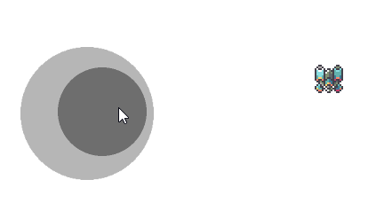

gamestick_sample



# Akashic Engine 向け ゲームスティック 拡張ライブラリ

Akashic Engineにおいて、ゲームスティックを利用するための拡張ライブラリです。


## インストール方法
Akashic Engineプロジェクトにて下記コマンドを実行してください.

```shell
akashic install @yasshi2525/simple-game-stick
```

## 利用方法

`@yasshi2525/simple-game-stick` モジュールの `GameStickEntity` クラスを利用することで、ゲームスティックエンティティを作成できます。

* JavaScriptの場合
```javascript
const { GameStickEntity } = require("@yasshi2525/simple-game-stick");
```

* Typescriptの場合
```typescript
import { GameStickEntity } from "@yasshi2525/simple-game-stick";
```

下記のコードでは、ゲームスティックを作成し、毎フレームゲームスティックの位置をコンソールに出力します。 (JavaScript, Typescript 共通)

```javascript
const scene = new g.Scene({ game: g.game })
scene.onLoad.add(() => {
  const obj = new GameStickEntity({
    scene,
    func: pos => {
      // pos.x, pos.y には -1 から +1 の範囲でゲームスティックの位置が格納されます。
      console.log(`GameStick position: (${pos.x}, ${pos.y})`);
    }
  });
  scene.append(obj);
});
g.game.pushScene(scene);
```

## オプション

`GameStickEntity` のコンストラクタにパラメータを指定することで以下のようにカスタマイズできます。

```javascript
const obj = new GameStickEntity({
  scene, // 配置するシーン
  area: { x: 10, y: 20, width: 200, height: 200 }, // 配置する場所と大きさ
  size: { width: 150, height: 150}, // バーチャルスティック本体の大きさ
  image: scene.asset.getImage("/assets/your-gamestick-image.png"), // バーチャルスティックの画像
  func: pos => { /* 毎フレーム呼び出される、ゲームスティックの位置を受け取る処理 */ },
});
```

| パラメータ名  | 設定例                                           | 必須か | 省略時のデフォルト値                                                         | 説明                                                                                                                                     |
|---------|-----------------------------------------------|-----|--------------------------------------------------------------------|----------------------------------------------------------------------------------------------------------------------------------------|
| `scene` | `g.Scene` インスタンス                              | yes | ---                                                                | ゲームスティックを配置するシーンを指定します。                                                                                                                |
| `area`  | `{ x: 100, y: 100, width: 400, height: 400 }` | no  | `x`, `y`, `width`, `height` の値。 `width`, `height` の指定がないときは画像の大きさ。 | ゲームスティックの配置場所と大きさを指定します。背景となるバーチャルスティックの影の大きさと一致します。指定すると `x`, `y`, `width`, `height` に値が設定されます。 `size` の方が大きい場合、 `size` の大きさに上書きされます。 |
| `size`  | `{width: 350, height: 350}`                   | no  | 画像の半分の大きさ                                                          | バーチャルスティック本体の大きさを指定します。 `area` の大きさより大きい場合、 `area` の大きさを上書きします。                                                                        |
| `image` | `g.ImageAsset` インスタンス                         | no  | 本ライブラリ組み込みの[画像](./image/game-stick.default.png)                    | バーチャルスティックとして描画する画像。                                                                                                                   |
| `func`  | `pos => { /* ... */ }`                        | no  | ---                                                                | ゲームスティックの位置を受け取った後の処理を指定します。引数 `pos` の `pos.x` と `pos.y` にはゲームスティックの位置が `-1` から `+1` の範囲で格納されます。毎フレーム呼び出されます。                          |

その他のオプションの詳細は [`g.EParameterObject`](https://akashic-games.github.io/akashic-engine/v3/interfaces/EParameterObject.html) を参照してください。

## 使い方の詳細

具体的な使い方は[サンプルプロジェクト](https://github.com/yasshi2525/gamestick_sample/blob/main/sample)を参照してください。

## アンインストール方法

Akashic Engineプロジェクトにて下記コマンドを実行してください.

```shell
akashic uninstall @yasshi2525/simple-game-stick
```

## License

MIT License

## Credits

本プロジェクトは [dera-](https://github.com/dera-) 氏が作成した[コード](https://github.com/dera-/gamestick_sample)を拡張ライブラリ向けに yasshi2525 が改変したものです。

This project is based on the original work by [dera-](https://github.com/dera-).

Modifications and ongoing maintenance by [yasshi2525](https://github.com/yasshi2525).

本ページのスクリーンショットの画像ならびに[サンプルプロジェクトの画像素材](./sample/image/player.png) には [Akashic Engine](https://akashic-games.github.io/) が [クリエイティブ・コモンズ 表示 2.1 日本ライセンス](https://creativecommons.org/licenses/by/2.1/jp/) の元で公開している [GALAXY WARS](https://akashic-games.github.io/asset/material.html#GALAXYWARS) の画像を利用しています。
